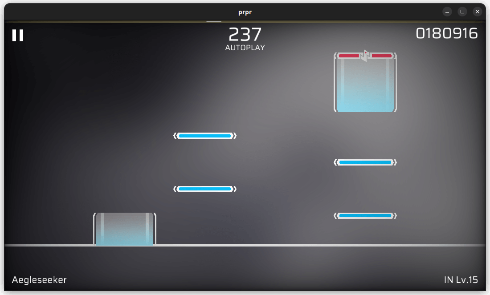

# vignette

虚光照效果。将屏幕的边缘调暗或调成其他颜色，可以用来模拟 Arcaea 的部分异象效果。

## 参数

- `color`（颜色，默认黑色 [r, g, b, a]）：边缘的颜色；
- `extend`（小数，默认 `0.25`，范围 `0-1`）：边缘的延伸程度，值越大黑色部分越多；
- `radius`（小数，默认 `15.0`）：中央光照大小，值越小受到影响的范围越大。
