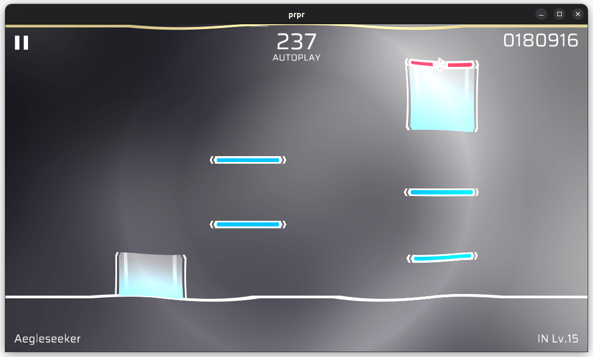

# `shockwave`

冲击波效果。建议配合 `progress` 的参数动画使用。

## 参数

- `progress`（小数，默认 `0.2`，范围 `0-1`）：冲击波的进度。冲击波是一个动画，`0` 进度为开始，直到 `1` 进度结束；
- `centerX`（小数，默认 `0.5`，范围 `0-1`）：冲击波中心的 X 坐标；
- `centerY`（小数，默认 `0.5`，范围 `0-1`）：冲击波中心的 Y 坐标；
- `width`（小数，默认 `0.1`）：冲击波的宽度；
- `distortion`（小数，默认 `0.8`）：冲击波扭曲程度；
- `expand`（小数，默认 `10.0`）：冲击波延伸广度。
