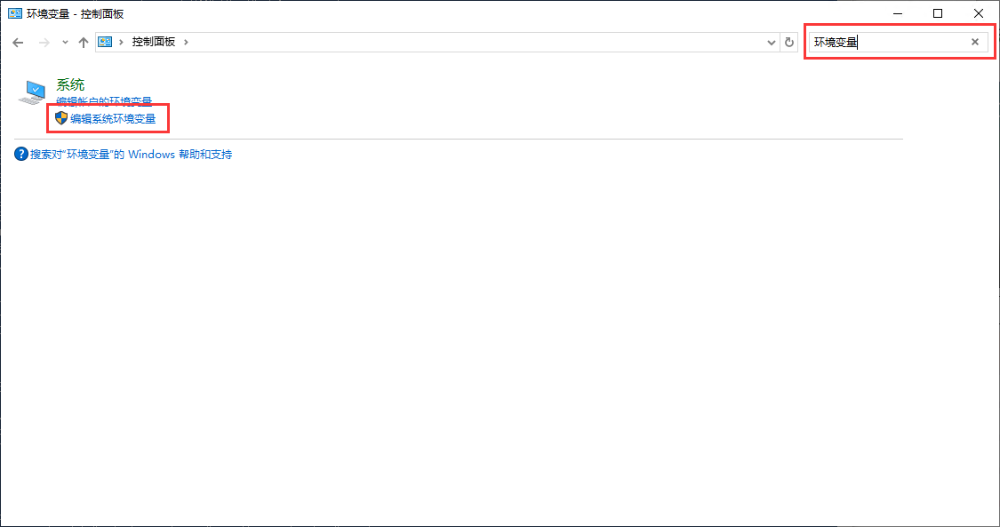
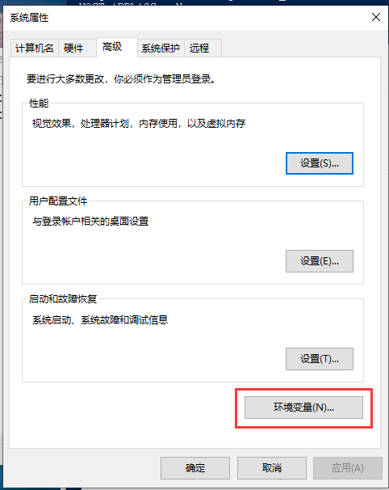
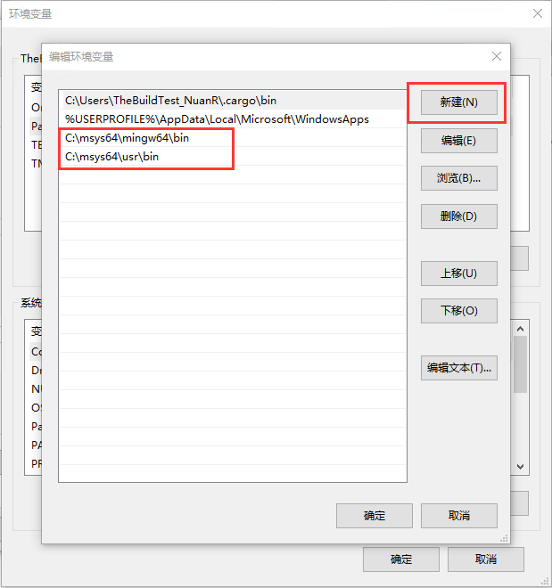

# Cargo 安装

## Windows

1. 点击 [这里](https://win.rustup.rs/) 下载构建工具安装程序。
2. 双击打开 `rustup-init.exe` 后出现安装窗口；输入`2` 然后输入 `y` 然后再次输入 `2` ，然后输入 `x86_64-pc-windows-gnu` ，最后一路回车开始安装，直到输出 `Rust is installed now. Great!`
    - __注意：不建议直接回车安装 MSVC，这在后续构建将会出现大量问题！__

3. 前往 [MSYS2](https://www.msys2.org/) 官网下载 MSYS2 安装程序，下载完成后双击打开，如无特殊需求，一路下一步即可，直到提示 `Finished the MSYS2 Setup`，点击右下角的按钮后将弹出一个窗口，输入以下指令，安装过程一路回车即可。
    >pacman -Sy && pacman -Syu
    >
    >pacman -S mingw-w64-x86_64-toolchain

4. 打开命令提示符（cmd）或 PowerShell，输入 `cargo -V` 检查是否成功安装，若返回版本号则安装成功，若出现其他提示，请见 Windows 常见问题。
5. 按下图所示，修改环境变量
    
6. 打开命令提示符（cmd）或 PowerShell，输入 `gcc -v` 检查是否成功安装，若返回版本号则安装成功，若出现其他提示，请见 Windows 常见问题。

### Windows 常见问题

Q. 双击运行下载成功后的构建工具闪退

A. 请不要更改文件名

## Linux

### Debian 分支 Linux 系统

1. 打开终端，输入以下命令：
    >sudo apt update
    >
    >sudo apt install cargo -y
2. 若无报错，输入 `cargo -V` 检查是否输出版本号，若出现其他输出，请见 Linux 常见问题

### Linux 常见问题

Q. 输入 `cargo` 时输出 `bash: /usr/bin/cargo: No such file or directory` 或 `cargo: command not found`

A. 未成功安装 cargo，请检查安装完成后是否输出了其他信息。

## macOS

1. 打开终端，输入以下命令
    >curl --proto '=https' --tlsv1.2 -sSf https://sh.rustup.rs | sh
2. 出现选项后输入1，一路回车直到输出 `Rust is installed now. Great!`
3. 打开终端，输入 `cargo -V` 检查是否成功安装，若返回版本号则安装成功，若出现其他提示，请见 macOS 常见问题。
4. 前往 [Xcode Downloads](https://developer.apple.com/download/all/?q=Xcode) 下载 Xcode，下载完成后双击解压放入盘符根目录 `/Application`，接着前往 [Command Line Tools Downloads](https://developer.apple.com/download/all/?q=Command%20Line%20Tools) 下载命令行工具，下载完成后双击打开，一路下一步直到安装完成即可。

其他系统待补充

### macOS 常见问题

Q. 安装 Cargo 时超时

A. 请检查网络环境

Q. 输入 `cargo` 时输出 `zsh: command not found: cargo`

A. 未成功安装 cargo，请检查安装完成后是否输出了其他信息。

