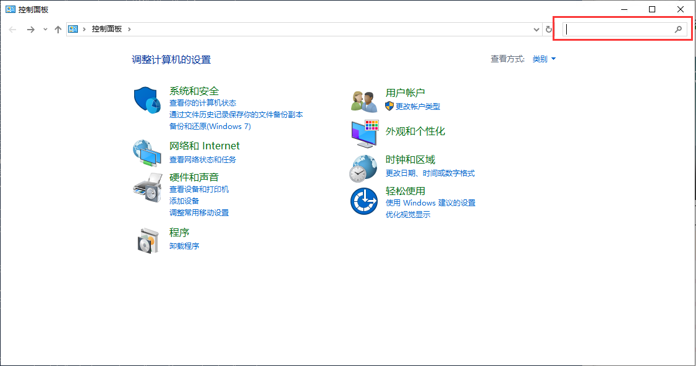
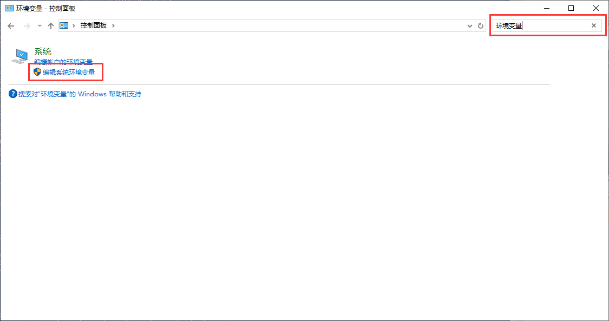
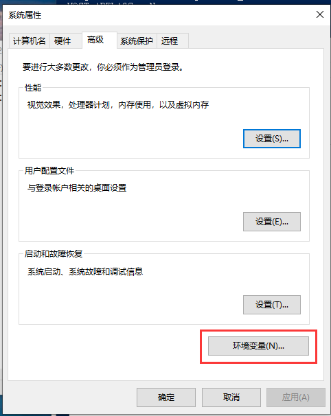
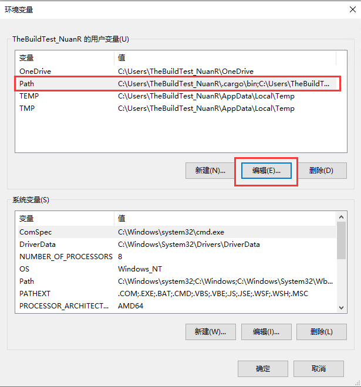
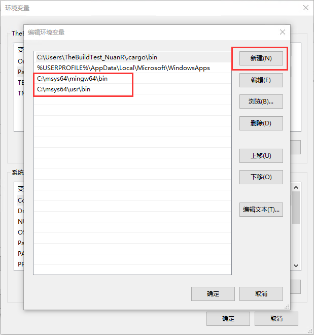

# Cargo 安装

## Windows GNU 工具链

- Windows GNU 工具链 依赖于 GCC 构建工具链，构建过程相对复杂，若您想要更简易的构建方式，请参考下方MSVC工具链安装方式进行构建，请按照以下步骤操作：

1. 点击 [这里](https://win.rustup.rs/) 下载构建工具安装程序。
2. 双击打开 `rustup-init.exe` 后出现安装窗口；输入`2` 然后输入 `y` 然后再次输入 `2` ，然后输入 `x86_64-pc-windows-gnu`
   ，最后一路回车开始安装，直到输出 `Rust is installed now. Great!`

3. 前往 [MSYS2](https://www.msys2.org/) 官网下载 MSYS2 安装程序，下载完成后双击打开，如无特殊需求，一路下一步即可，直到提示
   `Finished the MSYS2 Setup`，点击右下角的按钮后将弹出一个窗口，输入以下指令，安装过程一路回车即可。
```shell
pacman -Sy && pacman -Syu
pacman -S mingw-w64-x86_64-toolchain
```
4. 打开命令提示符（cmd）或 PowerShell，输入 `cargo -V` 检查是否成功安装，若返回版本号则安装成功，若出现其他提示，请见 Windows
   常见问题。
5. 按下图所示，修改环境变量
       
6. 打开命令提示符（cmd）或 PowerShell，输入 `gcc -v` 检查是否成功安装，若返回版本号则安装成功，若出现其他提示，请见 Windows
   常见问题。

### Windows GNU 工具链 常见问题

Q. 双击运行下载成功后的构建工具闪退

A. 请不要更改文件名

## Windows MSVC 工具链

- Windows MSVC 工具链 依赖于 Microsoft Visual C++ 构建工具链，构建过程相对简单（只要你不想跑去手动构建静态库），请按照以下步骤操作：

1. 点击 [这里](https://win.rustup.rs/) 下载构建工具安装程序。
2. 双击打开 `rustup-init.exe` 后出现安装窗口；输入`1`，根据 `Visual Studio Installer` 的提示安装完成后，回到 `rustup`
   的控制台一路回车直到输出 `Rust is installed now. Great!`
3. 重新打开 `Visual Studio Installer`，点击 `Visual Studio Community 2022` 右侧的 `修改(M)`，在 `单个组件` 中搜索 `SDK`
   ，并安装 `Windows 11 SDK` （可按需求使用其它版本SDK）。
4. 打开 `x64 Native Tools Command Prompt for VS 20**`，输入 `cargo -V` 检查是否成功安装，若返回版本号则安装成功，若出现其他提示，请见
   Windows 常见问题。

### Windows MSVC 工具链 常见问题

Q. 双击运行下载成功后的构建工具闪退

A. 请不要更改文件名

## Linux

### Debian 分支 Linux 系统

1. 打开终端，输入以下命令：
```shell
sudo apt update
sudo apt install cargo -y
```
2. 若无报错，输入 `cargo -V` 检查是否输出版本号，若出现其他输出，请见 Linux 常见问题

### Linux 常见问题

Q. 输入 `cargo` 时输出 `bash: /usr/bin/cargo: No such file or directory` 或 `cargo: command not found`

A. 未成功安装 cargo，请检查安装完成后是否输出了其他信息。

## macOS

1. 打开终端，输入以下命令
```shell
curl --proto '=https' --tlsv1.2 -sSf https://sh.rustup.rs | sh
```
2. 出现选项后输入1，一路回车直到输出 `Rust is installed now. Great!`
3. 打开终端，输入 `cargo -V` 检查是否成功安装，若返回版本号则安装成功，若出现其他提示，请见 macOS 常见问题。
4. 前往 [Command Line Tools Downloads](https://developer.apple.com/download/all/?q=Command%20Line%20Tools)
下载命令行工具，下载完成后双击打开，一路下一步直到安装完成即可。

其他系统待补充

### macOS 常见问题

Q. 安装 Cargo 时超时

A. 请检查网络环境

Q. 输入 `cargo` 时输出 `zsh: command not found: cargo`

A. 未成功安装 cargo，请检查安装完成后是否输出了其他信息。

