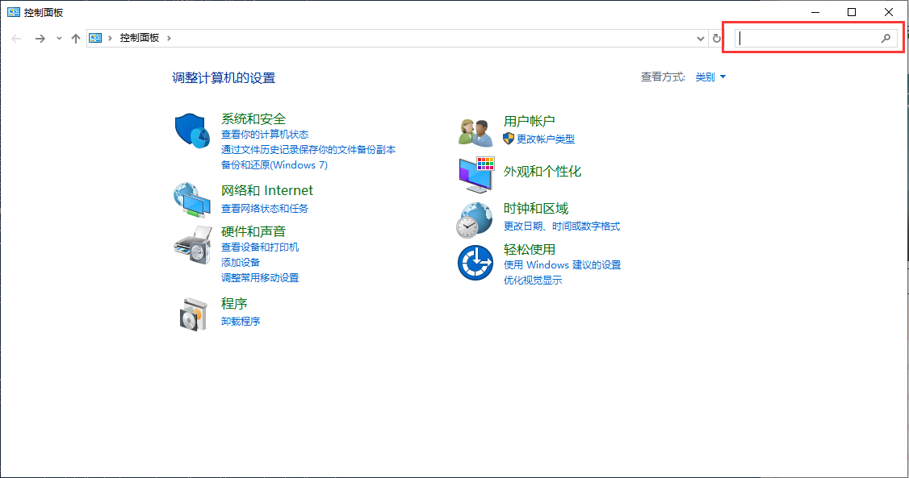
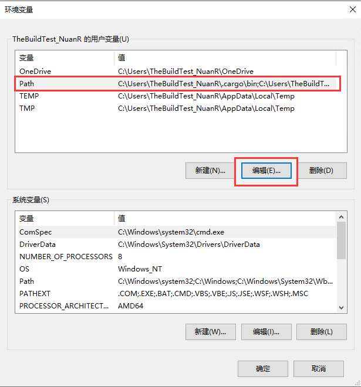

# Cargo 安装

## Windows

1. 点击 [这里](https://win.rustup.rs/) 下载构建工具安装程序。
2. 双击打开 `rustup-init.exe` 后出现安装窗口；输入`2` 然后输入 `y` 然后再次输入 `2` ，然后输入 `x86_64-pc-windows-gnu` ，最后一路回车开始安装，直到输出 `Rust is installed now. Great!`
    - __注意：千万不要直接回车安装 MSVC，这在后续构建将会出现大量问题！__

3. 前往 [MSYS2](https://www.msys2.org/) 官网下载 MSYS2 安装程序，下载完成后双击打开，如无特殊需求，一路下一步即可，直到提示 `Finished the MSYS2 Setup`，点击右下角的按钮后将弹出一个窗口，输入以下指令，安装过程一路回车即可。
    >pacman -Sy && pacman -Syu
    >
    >pacman -S mingw-w64-x86_64-toolchain
    - 如果您无法连接到 github，您也可以去 [缓存站](https://www.nuanr-mxi.com/msys.exe) 下载 MSYS2， __注意，缓存站只能保证您可以下载，不能高速下载，也不一定是最新版。__
4. 打开命令提示符（cmd）或 PowerShell，输入 `cargo -V` 检查是否成功安装，若返回版本号则安装成功，若出现其他提示，请见 Windows 常见问题。
5. 按下图所示，修改环境变量
    
6. 打开命令提示符（cmd）或 PowerShell，输入 `gcc -v` 检查是否成功安装，若返回版本号则安装成功，若出现其他提示，请见 Windows 常见问题。

### Windows 常见问题

Q. 双击运行下载成功后的构建工具闪退

A. 请不要更改文件名

## Linux

### Debian 分支 Linux 系统

1. 打开终端，输入以下命令：
    >sudo apt update
    >
    >sudo apt install cargo -y
2. 若无报错，输入 `cargo -V` 检查是否输出版本号，若出现其他输出，请见 Linux 常见问题

其他系统待补充

### Linux 常见问题

Q. 输入 `cargo` 时输出 `bash: /usr/bin/cargo: No such file or directory` 或 `cargo: command not found`

A. 未成功安装 cargo，请检查安装完成后是否输出了其他信息。
