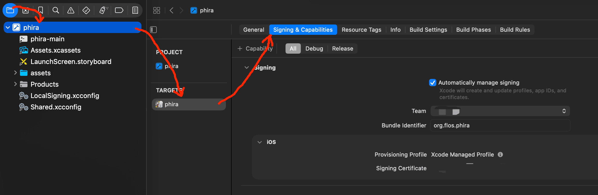
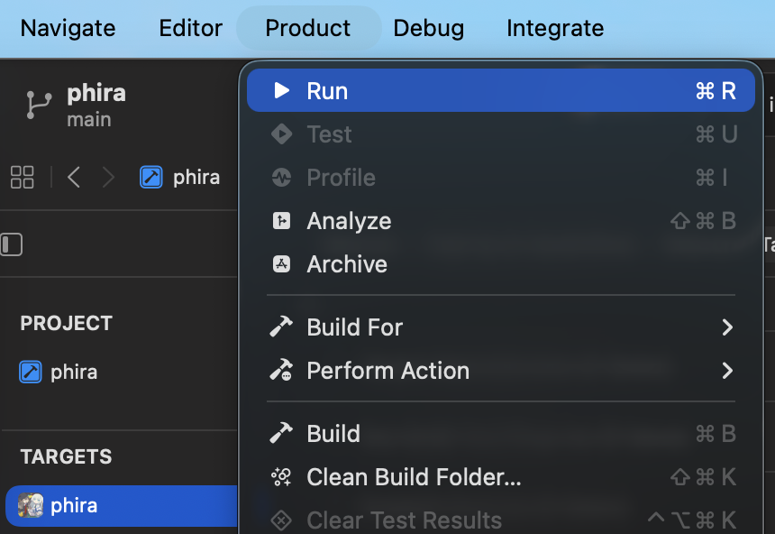

# iOS

## 准备阶段

1. 环境要求：
   - 一台安装了 macOS 的电脑，以及 [Xcode](https://developer.apple.com/xcode/) 15.3 或更高版本（本项目 `phira.xcodeproj` 的兼容版本为 Xcode 15.3）。
   - 确保命令行工具指向完整 Xcode，在终端执行：

     ```shell
     sudo xcode-select -s /Applications/Xcode.app/Contents/Developer
     xcodebuild -version
     ```

     若 `xcodebuild -version` 能正常输出版本号即可。
   - 安装 Rust（rustup）。在终端执行 `cargo -V` 检查，未安装请点击 [这里](./cargo.md#macos) 按步骤安装。仓库内的 `rust-toolchain.toml` 会把工具链锁定为 `nightly-2026-01-01`，首次进入仓库目录时 rustup 会自动安装。

2. 获取源码：

   ```shell
   git clone https://github.com/TeamFlos/phira.git
   ```

   注意事项同 [macOS](./macOS.md) 指南：路径中不要包含非 ASCII 字符；若无法连接 GitHub 可使用镜像加速；要构建指定版本请前往 [Release](https://github.com/TeamFlos/phira/releases) 下载 `Source code (tar.gz)`。

3. 添加 iOS 构建目标。在仓库目录下执行：

   ```shell
   rustup show   # 首次会安装 rust-toolchain.toml 锁定的工具链
   ```

   然后按需添加对应目标：

   - 真机调试（手头有 iPhone/iPad）：`rustup target add aarch64-apple-ios`
   - 模拟器，Apple Silicon（M 系列）：`rustup target add aarch64-apple-ios-sim`
   - 模拟器，Intel：`rustup target add x86_64-apple-ios`

   没有真机用模拟器即可（无需签名）；有真机则连接设备走真机调试（需签名，见下文）。

4. 视频解码用的 FFmpeg 静态库：`prpr-avc` 的构建脚本会在首次编译时自动从 prpr-avc-ffmpeg 的 [Release](https://github.com/TeamFlos/prpr-avc-ffmpeg/releases/latest) 下载并解压到 `prpr-avc/static-lib/<目标平台>/`。若自动下载失败，也可手动准备，见[静态库](./StaticLib.md#获取)页。

## 补全被忽略的配置文件

> <span style="color:red;">注意：以下三个文件被 `.gitignore` 忽略，`git clone` 后并不存在，需要手动创建——前两个缺失会导致构建失败（真机构建在签名阶段失败），第三个用于真机的链接参数（iOS 12 兼容）。</span>

### 1. 签名配置 `xcode/LocalSigning.xcconfig`

`xcode/Shared.xcconfig` 通过 `#include?` 引入本文件来提供签名信息。在 `xcode/` 目录下新建 `LocalSigning.xcconfig`：

```
LOCAL_DEVELOPMENT_TEAM = XXXXXXXXXX
LOCAL_CODE_SIGN_STYLE = Automatic
LOCAL_CODE_SIGN_IDENTITY = Apple Development
LOCAL_PROVISIONING_PROFILE_SPECIFIER =
CURRENT_PROJECT_VERSION = 1
```

- `LOCAL_DEVELOPMENT_TEAM` 填你自己的 Team ID（10 位字符串）。在 Xcode → Settings → Accounts 里可以查看；免费 Apple ID 也能使用个人团队，但真机安装后签名有效期约 7 天。
- `CURRENT_PROJECT_VERSION` 为构建号（Build Number），可自行调整；版本号 `MARKETING_VERSION` 在 `Shared.xcconfig` 中，需与 `Cargo.toml` 保持一致，请勿随意修改。
- 即使只在模拟器运行，也建议创建本文件（`LOCAL_DEVELOPMENT_TEAM` 可留空），否则签名相关变量为空。

### 2. 应用信息 `phira.app/Info.plist`

`phira.xcodeproj` 的 `INFOPLIST_FILE` 指向 `phira.app/Info.plist`，但整个 `phira.app/` 目录被忽略。手动创建该目录并新建 `Info.plist`，内容如下：

```xml
<?xml version="1.0" encoding="UTF-8"?>
<!DOCTYPE plist PUBLIC "-//Apple//DTD PLIST 1.0//EN" "http://www.apple.com/DTDs/PropertyList-1.0.dtd">
<plist version="1.0">
<dict>
	<key>CFBundleDevelopmentRegion</key>
	<string>zh-CN</string>
	<key>CFBundleExecutable</key>
	<string>phira-main</string>
	<key>CFBundleIdentifier</key>
	<string>$(PRODUCT_BUNDLE_IDENTIFIER)</string>
	<key>CFBundleInfoDictionaryVersion</key>
	<string>6.0</string>
	<key>CFBundleName</key>
	<string>Phira</string>
	<key>CFBundlePackageType</key>
	<string>APPL</string>
	<key>CFBundleShortVersionString</key>
	<string>$(MARKETING_VERSION)</string>
	<key>CFBundleVersion</key>
	<string>$(CURRENT_PROJECT_VERSION)</string>
	<key>CFBundleIcons</key>
	<dict>
		<key>CFBundlePrimaryIcon</key>
		<dict>
			<key>CFBundleIconName</key>
			<string>AppIcon</string>
		</dict>
	</dict>
	<key>ITSAppUsesNonExemptEncryption</key>
	<false/>
	<key>MinimumOSVersion</key>
	<string>12.0.0</string>
	<key>UILaunchStoryboardName</key>
	<string>LaunchScreen</string>
	<key>UIRequiredDeviceCapabilities</key>
	<array>
		<string>arm64</string>
	</array>
	<key>UIRequiresFullScreen</key>
	<true/>
	<key>UISupportedInterfaceOrientations</key>
	<array>
		<string>UIInterfaceOrientationLandscapeLeft</string>
		<string>UIInterfaceOrientationLandscapeRight</string>
	</array>
</dict>
</plist>
```

- 这里的 `phira.app/` 目录**只作为 `Info.plist` 的源文件存放位置**，实际编译产物 `Phira.app` 会输出到 Xcode 的 DerivedData，二者不是一回事。
- `CFBundleExecutable` 必须为 `phira-main`——实际的入口程序是 Rust 编译产物，由「Cargo Build」阶段拷贝进 App 包，而不是 Xcode 默认生成的同名可执行文件。

### 3. 构建配置 `.cargo/config.toml`

`.cargo/config.toml` 同样被 `.gitignore` 忽略。真机构建需要为 `aarch64-apple-ios` 指定链接参数（弱链接 iOS 14 才有的 `UniformTypeIdentifiers` 框架，否则在 iOS 12/13 设备上启动即崩溃）。新建 `.cargo/config.toml`：

```toml
[target.aarch64-apple-ios]
rustflags = [
    "-C",
    "link-args=-miphoneos-version-min=9.0 -weak_framework UniformTypeIdentifiers",
    "-C",
    "linker=/Applications/Xcode.app/Contents/Developer/Toolchains/XcodeDefault.xctoolchain/usr/bin/cc",
]
```

- 若 Xcode 未安装在默认路径 `/Applications/Xcode.app`，请相应修改 `linker`。
- 模拟器构建使用默认链接即可，无需本配置。

## 开始构建

1. 打开工程：

   ```shell
   open phira.xcodeproj
   ```

2. 在 Xcode 顶部选择 scheme `phira`，目标设备选择真机或模拟器。
3. 真机运行：在 `TARGETS → phira → Signing & Capabilities` 中确认已勾选「Automatically manage signing」且 Team 为你的团队（由上一步的 `LocalSigning.xcconfig` 提供）。首次安装需在设备上信任开发者证书。
   
4. 点击运行（⌘R），默认使用 Debug 配置，确认使用的设备（模拟器或真机）。首次构建较慢：需要拉取 git 依赖、下载 FFmpeg 静态库并编译整个 Rust 工程。
   
5. 构建过程说明：Xcode 的「Cargo Build」脚本阶段会根据所选平台自动确定 Rust 目标（真机 `aarch64-apple-ios`，模拟器 `aarch64-apple-ios-sim` / `x86_64-apple-ios`），执行 `cargo build --bin phira-main --target <目标>`，并把产物拷贝为 `build/phira-main`，再由 Copy Files 阶段放入 `Phira.app`。

> 如需 Release 构建，可在 Product → Scheme → Edit Scheme → Run 中将 Build Configuration 改为 Release。
