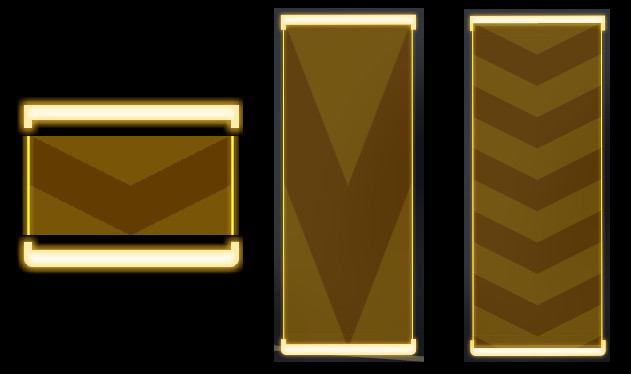

# 资源包

在 prpr 中，你可以自定义资源包。资源包包含了音符的样式、粒子效果、打击音效等等元素。你可以在测试群或频道中找到资源包，也可以选择自己制作资源包。以下将具体阐述资源包的文件结构。

## 结构

资源包是单个 zip 压缩文件，其中包含了配置文件 `info.yml` 和其他的资源文件。其中，资源文件有些是必须存在，有些则是可选的。

### 资源文件

资源文件必须包括：

- `click.png` 和 `click_mh.png`：Click 音符的皮肤，`mh` 代表双押；
- `drag.png` 和 `drag_mh.png`：Drag 音符的皮肤，`mh` 代表双押；
- `flick.png` 和 `flick_mh.png`：Flick 音符的皮肤，`mh` 代表双押；
- `hold.png` 和 `hold_mh.png`：Hold 音符的皮肤，`mh` 代表双押；
- `hit_fx.png`：打击特效图片，必须为透明背景，除特殊需求外图像色彩均为灰度。

资源文件可以包括（即若不包括，将使用默认）：

- `click.ogg`、`drag.ogg` 和 `flick.ogg`：对应音符的打击音效，若使用 prpr-render 渲染，采样率必须为 44100Hz；
- `ending.ogg`：结算界面背景音乐。

### 配置文件

配置文件采用 yml，其中必填项如下（以默认资源包为例）：

```yml
# 必填
name: "Default"
author: "XingLuELEC"
hitFx: [8, 8]
holdAtlas: [50, 50]
holdAtlasMH: [200, 200]
# 选填
description: "打击音效来自：小赵同学"
hitFxDuration: 0.5
hitFxScale: 1.2
hitFxRotate: true
hideParticles: false
circleParticles: true
particleCount: 4
holdKeepHead: false
holdRepeat: false
holdCompact: false
hitFxTinted: true
LineTinted: true
colorPerfectFx: [1.0, 0.9, 0.65, 0.9]
colorGoodFx: [0.70, 0.9, 1.0, 0.9]
colorPerfectLine: [1.0, 1.0, 0.7, 1.0]
colorGoodLine: [0.65, 0.94, 1.0, 1.0]
```

- `name` 资源包的名字；
- `author` 资源包的作者；
- `hitFx` 打击特效宽、高的个数，用于切割原图生成动画；
- `holdAtlas` Hold 贴图的尾、头像素。Hold 的皮肤是 **一张图片**，从上到下分别为 Hold 的尾部、中间和头部。而 `holdAtlas` 的两个数字则分别指定了图片中尾部和头部的高度。例如，在 [此图](image/hold.png) 中，尾部和头部高度均为 50 像素；
- `holdAtlasMH` 意义与上一条相同，指定多押 Hold 的尾、头像素；

此外还有选填项：

- `description` 资源包介绍；
- `hitFxDuration` (小数，默认 `0.5`)  打击特效的持续时间，以秒为单位；
- `hitFxScale` (小数，默认 `1.0`)  打击特效缩放比例；
- `hitFxRotate` (布尔值，默认 `false`)  打击特效是否随 Note 旋转；
- `hideParticles` (布尔值，默认 `false`)  是否隐藏粒子效果；
- `circleParticles` (布尔值，默认 `false`)  是否使用圆形粒子效果；
- `particleCount` (整数，默认 `4`)  打击特效的粒子数量；
- `holdKeepHead` (布尔值，默认 `false`)  Hold 触线后是否显示头部；
- `holdRepeat` (布尔值，默认 `false`)  Hold 的中间部分是否采用重复式拉伸。 这里的三张图从左到右依次是 Hold 原图、不启用 `holdRepeat` 时的长条和启用 `holdRepeat` 时的长条；
- `holdCompact` (布尔值，默认 `false`)  是否把 Hold 的头部和尾部与 Hold 中间重叠 (将锚点居中)。还是用上面的图，如果不开启 `holdCompact`，效果就会是左边第一张图，Hold 的头尾是和中间隔开的；而右边两张图都是开启了 `holdCompact` 的效果；
- `hitFxTinted` (布尔值，默认 `true`)  打击特效是否着色；
- `LineTinted` (布尔值，默认 `true`)  判定线是否着色；
- `colorPerfectFx` AP (All Perfect) 情况下的打击特效颜色 `[R, G, B, A]` 内容均为 `0.0..1.0` 的 `浮点数`；
- `colorGoodFx` FC (Full Combo)  情况下的打击特效颜色；
- `colorPerfectLine` AP (All Perfect)  情况下的判定线颜色；
- `colorGoodLine` FC (Full Combo)  情况下的判定线颜色；
